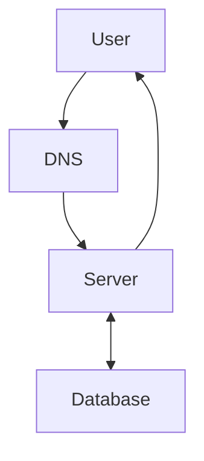

# justatest
some text in this description


Some basic Git commands are:
```html
<input type="text">
```
CSS:
```css
input[type="text"] {
  width: 100%;
  background-color: #0969DA;
}
```

It has full width and its background is in `rgb(9, 105, 218)` color.

See 


- [ ] See my logo
- [X] Close the tabs
- [ ] \(Optional) Open a followup issue


It also uses Javascript[^1]


[^1]: Javascript - Programming Language


<!-- This content will not appear in the rendered Markdown -->
# Statistics


| First table | Second table |
| ----------- | -----------: |
| Hi haaa     | Nope         |
| my logo     | kola         |


<details><summary>CLICK ME</summary>
<p>

#### We can hide anything, even code!

```ruby
   puts "Hello World"
```

</p>
</details>




>Theory of Pythagoras

$c = \sqrt{a^2 + b^2}$
